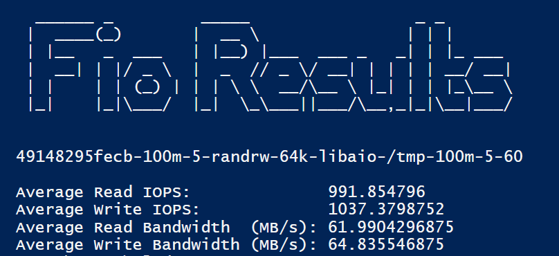

# openshift-test-page-v2

to test the docker image use this command:

docker run -p 8080:8080 devopsteamsdb/devopsteamsdb:openshift_test_page_v2_latest

via https://labs.play-with-docker.com


```powershell


$NUMFILES = 5
$FioOutputString = Invoke-RestMethod -Uri "http://192.168.201.129:8080/fiojson?size=100m&numjobs=$($NUMFILES)&rw=randrw&blocksize=64k&ioengine=libaio&directory=/tmp&runtime=60"
$FioOutputObj = $FioOutputString | ConvertFrom-Json

$TOTAL_READ_IOPS  = $FioOutputObj.jobs.read.iops | measure -Sum | select -ExpandProperty sum
$TOTAL_WRITE_IOPS = $FioOutputObj.jobs.write.iops | measure -Sum | select -ExpandProperty sum
$TOTAL_READ_BW    = ($FioOutputObj.jobs.read.bw | measure -Sum | select -ExpandProperty sum) / 1024
$TOTAL_WRITE_BW   = ($FioOutputObj.jobs.write.bw | measure -Sum | select -ExpandProperty sum) / 1024

Clear-Host


#Write-Host "-------------------------------- Results --------------------------------"

$str = @"

  ______ _         _____                 _ _        
 |  ____(_)       |  __ \               | | |       
 | |__   _  ___   | |__) |___  ___ _   _| | |_ ___  
 |  __| | |/ _ \  |  _  // _ \/ __| | | | | __/ __| 
 | |    | | (_) | | | \ \  __/\__ \ |_| | | |_\__ \ 
 |_|    |_|\___/  |_|  \_\___||___/\__,_|_|\__|___/ 


"@
Write-Host $str

$FioOutputObj.jobs[0].'job options'.psobject.Properties.value -join '-'
Write-Host

$AVG_READ_IOPS = $TOTAL_READ_IOPS / $NUMFILES
Write-Host "Average Read IOPS: `t`t`t`t$($AVG_READ_IOPS)"

$AVG_WRITE_IOPS = $TOTAL_WRITE_IOPS / $NUMFILES
Write-Host "Average Write IOPS: `t`t`t$($AVG_WRITE_IOPS)"

$AVG_READ_BW    = $TOTAL_READ_BW / $NUMFILES
Write-Host "Average Read Bandwidth  (MB/s): $($AVG_READ_BW)"

$AVG_WRITE_BW   = $TOTAL_WRITE_BW / $NUMFILES
Write-Host "Average Write Bandwidth (MB/s): $($AVG_WRITE_BW)"

```

