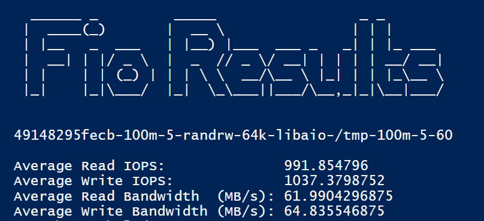

# openshift-test-page-v2

To test the docker image, use this command:

```bash
docker run -p 8080:8080 devopsteamsdb/devopsteamsdb:openshift_test_page_v2_latest
```

## Raw API Endpoints

The container exposes a raw JSON API for automated testing and analysis.

### `GET /fiojson`
Runs a benchmark using `fio` and returns the raw JSON results directly (without double-serialization).

**Query Parameters (All optional, with default values if omitted):**
- `size` (default: `100m`): size of the test file (e.g. `500m`, `1g`).
- `numjobs` (default: `1`): number of thread/job instances (e.g. `5`).
- `rw` (default: `rw`): read/write workload pattern (`rw`, `randrw`, `read`, `write`).
- `blocksize` (default: `4k`): I/O block size (e.g. `4k`, `16k`, `64k`).
- `ioengine` (default: `libaio`): I/O engine to use (`libaio`, `sync`, `mmap`).
- `directory` (default: `/tmp`): target directory for the benchmark files.
- `runtime` (default: `30`): stress test duration in seconds (e.g. `60`).

### PowerShell Example

```powershell
$NUMFILES = 5
# Query the raw JSON API directly - the response is parsed automatically into an object
$FioOutputObj = Invoke-RestMethod -Uri "http://192.168.201.129:8080/fiojson?size=500m&numjobs=$($NUMFILES)&rw=rw&blocksize=4k&ioengine=libaio&directory=/tmp&runtime=60"

$TOTAL_READ_IOPS  = $FioOutputObj.jobs.read.iops | measure -Sum | select -ExpandProperty sum
$TOTAL_WRITE_IOPS = $FioOutputObj.jobs.write.iops | measure -Sum | select -ExpandProperty sum
$TOTAL_READ_BW    = ($FioOutputObj.jobs.read.bw | measure -Sum | select -ExpandProperty sum) / 1024
$TOTAL_WRITE_BW   = ($FioOutputObj.jobs.write.bw | measure -Sum | select -ExpandProperty sum) / 1024

Clear-Host

$str = @"

  ______ _         _____                 _ _        
 |  ____(_)       |  __ \               | | |       
 | |__   _  ___   | |__) |___  ___ _   _| | |_ ___  
 |  __| | |/ _ \  |  _  // _ \/ __| | | | | __/ __| 
 | |    | | (_) | | | \ \  __/\__ \ |_| | | |_\__ \ 
 |_|    |_|\___/  |_|  \_\___||___/\__,_|_|\__|___/ 


"@
Write-Host $str

$FioOutputObj.jobs[0].'job options'.psobject.Properties.value -join '-'
Write-Host

$AVG_READ_IOPS = $TOTAL_READ_IOPS / $NUMFILES
Write-Host "Average Read IOPS: `t`t`t`t$($AVG_READ_IOPS)"

$AVG_WRITE_IOPS = $TOTAL_WRITE_IOPS / $NUMFILES
Write-Host "Average Write IOPS: `t`t`t$($AVG_WRITE_IOPS)"

$AVG_READ_BW    = $TOTAL_READ_BW / $NUMFILES
Write-Host "Average Read Bandwidth  (MB/s): $($AVG_READ_BW)"

$AVG_WRITE_BW   = $TOTAL_WRITE_BW / $NUMFILES
Write-Host "Average Write Bandwidth (MB/s): $($AVG_WRITE_BW)"
```

